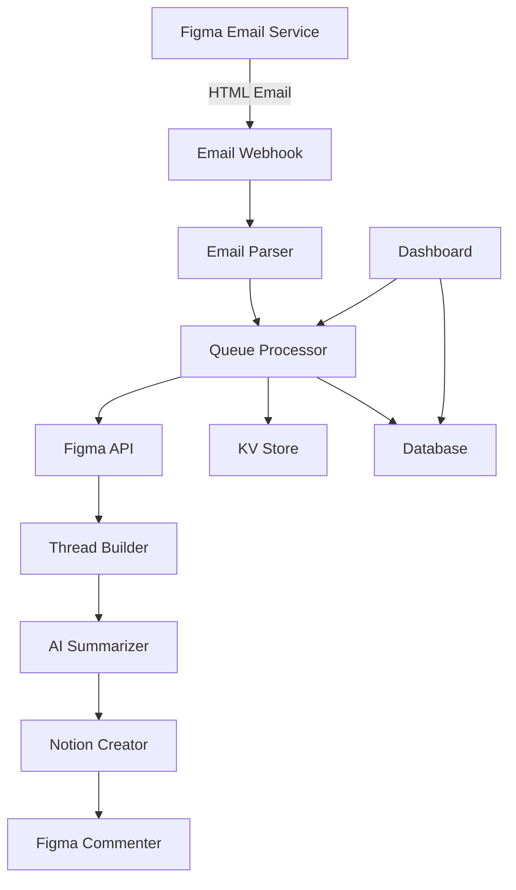

# FigJam to Notion Sync Service - Comprehensive Implementation Briefing

## Executive Summary

This briefing outlines the development of an automated workflow system that bridges FigJam design discussions and Notion task management. The system monitors Figma email notifications for mentions, reconstructs comment threads, generates AI summaries, and creates actionable tasks in Notion with confirmation feedback loops.

**Key Value Proposition**: Prevent critical design decisions from getting lost in collaborative discussions by automatically converting them into trackable, actionable tasks.

## System Architecture Overview

### High-Level Architecture



### Technology Stack

- **Framework**: Nuxt 3 with NuxtHub
- **Queue System**: NuxtHub Queues (Cloudflare Queues)
- **Database**: SQLite (via Drizzle ORM) + D1
- **KV Store**: Cloudflare KV
- **AI Provider**: Anthropic Claude API
- **External APIs**: Figma API v1, Notion API v2
- **Deployment**: Cloudflare Edge via NuxtHub

## Detailed Technical Specifications

### 1. Email Processing Pipeline

#### Webhook Endpoint
```typescript
// server/api/webhook/figma.post.ts
interface FigmaEmailPayload {
  from: string
  to: string
  subject: string
  html: string
  text?: string
  timestamp: number
  messageId: string
}

export default defineEventHandler(async (event) => {
  // 1. Validate webhook signature
  const signature = getHeader(event, 'x-webhook-signature')
  if (!verifySignature(signature, body)) {
    throw createError({ statusCode: 401, statusMessage: 'Invalid signature' })
  }

  // 2. Parse request body
  const payload = await readValidatedBody(event, FigmaEmailPayload.parse)

  // 3. Check for duplicate processing
  const kv = hubKV()
  const processed = await kv.get(`email:${payload.messageId}`)
  if (processed) {
    return { status: 'already_processed' }
  }

  // 4. Queue for processing
  const queue = await useQueue('figma-sync')
  await queue.send({
    type: 'PROCESS_EMAIL',
    payload,
    attempts: 0
  })

  // 5. Mark as queued
  await kv.set(`email:${payload.messageId}`, 'queued', { expirationTTL: 86400 })

  return { status: 'queued', messageId: payload.messageId }
})
```

#### HTML Email Parser
```typescript
// server/utils/emailParser.ts
interface ParsedComment {
  text: string
  fileName: string
  trackingUrl: string
  userHandle: string
  timestamp: Date
}

export function parseF igmaEmail(html: string): ParsedComment {
  const $ = cheerio.load(html)

  // Extract comment text (after mention)
  const mentionPattern = /@(\w+)/g
  const commentElements = $('td').filter((_, el) => {
    const text = $(el).text()
    return mentionPattern.test(text)
  })

  // Get most recent (opacity:1)
  const recentComment = commentElements.filter((_, el) => {
    const style = $(el).attr('style')
    return !style?.includes('opacity:0')
  }).first()

  // Extract file name (gray text)
  const fileName = $('span[style*="color:#808080"]').first().text().trim()

  // Extract tracking URL
  const trackingUrl = $('a[href*="click.figma.com"]').first().attr('href') || ''

  // Parse user handle
  const userHandle = recentComment.text().match(/@(\w+)/)?.[1] || ''

  return {
    text: recentComment.text().replace(/@\w+\s*/, '').trim(),
    fileName,
    trackingUrl,
    userHandle,
    timestamp: new Date()
  }
}
```

### 2. Queue Processing System

#### Queue Worker Implementation
```typescript
// server/tasks/figma-sync.ts
import { defineTask } from '#hub/tasks'

export default defineTask({
  name: 'figma-sync',
  async run(payload: QueuePayload) {
    const { type, data, attempts } = payload

    try {
      switch (type) {
        case 'PROCESS_EMAIL':
          return await processEmail(data)
        case 'RETRY_FAILED':
          return await retryFailed(data)
        default:
          throw new Error(`Unknown task type: ${type}`)
      }
    } catch (error) {
      // Implement exponential backoff
      if (attempts < MAX_RETRIES) {
        const delay = Math.pow(2, attempts) * 1000
        await queue.sendDelayed({
          ...payload,
          attempts: attempts + 1
        }, delay)
      } else {
        // Log to dead letter queue
        await logFailure(payload, error)
      }
      throw error
    }
  }
})
```

#### Circuit Breaker Pattern
```typescript
// server/utils/circuitBreaker.ts
class CircuitBreaker {
  private failures = 0
  private lastFailure: Date | null = null
  private state: 'CLOSED' | 'OPEN' | 'HALF_OPEN' = 'CLOSED'

  constructor(
    private threshold = 5,
    private timeout = 60000,
    private resetTimeout = 30000
  ) {}

  async call<T>(fn: () => Promise<T>): Promise<T> {
    if (this.state === 'OPEN') {
      if (Date.now() - this.lastFailure!.getTime() > this.timeout) {
        this.state = 'HALF_OPEN'
      } else {
        throw new Error('Circuit breaker is OPEN')
      }
    }

    try {
      const result = await fn()
      if (this.state === 'HALF_OPEN') {
        this.reset()
      }
      return result
    } catch (error) {
      this.recordFailure()
      throw error
    }
  }

  private recordFailure() {
    this.failures++
    this.lastFailure = new Date()

    if (this.failures >= this.threshold) {
      this.state = 'OPEN'
    }
  }

  private reset() {
    this.failures = 0
    this.lastFailure = null
    this.state = 'CLOSED'
  }
}

// Usage
const figmaBreaker = new CircuitBreaker()
const notionBreaker = new CircuitBreaker()
const aiBreaker = new CircuitBreaker()
```

### 3. Figma Integration Layer

#### API Client
```typescript
// server/services/figma.ts
class FigmaService {
  private client: AxiosInstance
  private breaker: CircuitBreaker

  constructor(private apiToken: string) {
    this.client = axios.create({
      baseURL: 'https://api.figma.com/v1',
      headers: {
        'X-Figma-Token': apiToken
      }
    })
    this.breaker = new CircuitBreaker()
  }

  async getComments(fileKey: string, since?: Date): Promise<FigmaComment[]> {
    return this.breaker.call(async () => {
      const response = await this.client.get(`/files/${fileKey}/comments`)
      return response.data.comments
        .filter((c: any) => !since || new Date(c.created_at) > since)
        .slice(0, 10) // Last 10 comments
    })
  }

  async getThread(fileKey: string, commentId: string): Promise<CommentThread> {
    return this.breaker.call(async () => {
      const comments = await this.getComments(fileKey)
      const targetComment = comments.find(c => c.id === commentId)

      if (!targetComment) {
        throw new Error('Comment not found')
      }

      // Build thread
      if (targetComment.parent_id) {
        // Get parent and all siblings
        const parent = comments.find(c => c.id === targetComment.parent_id)
        const siblings = comments.filter(c => c.parent_id === targetComment.parent_id)
        return { parent, replies: siblings }
      } else {
        // Get all replies
        const replies = comments.filter(c => c.parent_id === commentId)
        return { parent: targetComment, replies }
      }
    })
  }

  async postComment(fileKey: string, message: string, parentId?: string): Promise<void> {
    return this.breaker.call(async () => {
      await this.client.post(`/files/${fileKey}/comments`, {
        message,
        comment_id: parentId
      })
    })
  }
}
```

#### Comment Matching Algorithm
```typescript
// server/utils/commentMatcher.ts
interface MatchCriteria {
  text: string
  userHandle: string
  timestamp: Date
  threshold?: number // minutes
}

export function findMatchingComment(
  comments: FigmaComment[],
  criteria: MatchCriteria
): FigmaComment | null {
  const { text, userHandle, timestamp, threshold = 15 } = criteria

  // Score each comment
  const scored = comments.map(comment => {
    let score = 0

    // Text similarity (using Levenshtein distance)
    const textSimilarity = similarity(comment.message, text)
    score += textSimilarity * 50

    // User match
    if (comment.user.handle === userHandle) {
      score += 30
    }

    // Time proximity
    const timeDiff = Math.abs(timestamp.getTime() - new Date(comment.created_at).getTime())
    const minutesDiff = timeDiff / 60000
    if (minutesDiff < threshold) {
      score += (threshold - minutesDiff) * 2
    }

    return { comment, score }
  })

  // Return best match if score > 70
  const best = scored.sort((a, b) => b.score - a.score)[0]
  return best.score > 70 ? best.comment : null
}
```

### 4. AI Summary Generation

#### Claude Integration
```typescript
// server/services/ai.ts
class AIService {
  private anthropic: Anthropic
  private breaker: CircuitBreaker
  private cache: Map<string, CachedSummary>

  constructor(apiKey: string) {
    this.anthropic = new Anthropic({ apiKey })
    this.breaker = new CircuitBreaker()
    this.cache = new Map()
  }

  async generateSummary(thread: CommentThread): Promise<TaskSummary> {
    // Check cache
    const cacheKey = this.getCacheKey(thread)
    const cached = this.cache.get(cacheKey)
    if (cached && cached.expires > Date.now()) {
      return cached.summary
    }

    return this.breaker.call(async () => {
      const prompt = this.buildPrompt(thread)

      const response = await this.anthropic.messages.create({
        model: 'claude-3-haiku-20240307',
        max_tokens: 500,
        messages: [{
          role: 'user',
          content: prompt
        }]
      })

      const summary = this.parseResponse(response.content[0].text)

      // Cache for 1 hour
      this.cache.set(cacheKey, {
        summary,
        expires: Date.now() + 3600000
      })

      return summary
    })
  }

  private buildPrompt(thread: CommentThread): string {
    const threadText = this.formatThread(thread)

    return `Analyze this Figma design discussion and create a task summary.

Thread:
${threadText}

Generate a JSON response with:
{
  "title": "Brief task title (max 60 chars)",
  "summary": "2-3 sentence summary of the discussion",
  "actionItems": ["action 1", "action 2"],
  "priority": "low|medium|high",
  "category": "design|development|review|other"
}`
  }

  private formatThread(thread: CommentThread): string {
    const allComments = [thread.parent, ...thread.replies]
      .sort((a, b) => new Date(a.created_at).getTime() - new Date(b.created_at).getTime())

    return allComments
      .map(c => `${format(new Date(c.created_at), 'HH:mm')} - ${c.user.handle}: ${c.message}`)
      .join('\n')
  }
}
```

### 5. Notion Integration

#### Task Creation Service
```typescript
// server/services/notion.ts
class NotionService {
  private client: Client
  private breaker: CircuitBreaker

  constructor(apiKey: string) {
    this.client = new Client({ auth: apiKey })
    this.breaker = new CircuitBreaker()
  }

  async createTask(
    databaseId: string,
    task: TaskData
  ): Promise<{ id: string; url: string }> {
    return this.breaker.call(async () => {
      const response = await this.client.pages.create({
        parent: { database_id: databaseId },
        icon: { type: 'emoji', emoji: '🎨' },
        properties: {
          Title: {
            title: [{ text: { content: task.title } }]
          },
          Summary: {
            rich_text: [{ text: { content: task.summary } }]
          },
          'Figma File': {
            rich_text: [{ text: { content: task.fileName } }]
          },
          'Figma Thread': {
            url: task.threadUrl
          },
          Priority: {
            select: { name: task.priority }
          },
          Category: {
            select: { name: task.category }
          },
          'Action Items': {
            rich_text: task.actionItems.map(item => ({
              text: { content: `• ${item}\n` }
            }))
          },
          Status: {
            select: { name: 'To Do' }
          },
          'Created From': {
            select: { name: 'Figma' }
          },
          'Mentioned User': {
            rich_text: [{ text: { content: task.mentionedUser } }]
          }
        }
      })

      return {
        id: response.id,
        url: response.url
      }
    })
  }

  async updateTask(pageId: string, updates: Partial<TaskData>): Promise<void> {
    return this.breaker.call(async () => {
      await this.client.pages.update({
        page_id: pageId,
        properties: this.mapToNotionProperties(updates)
      })
    })
  }
}
```

### 6. Database Schema

```typescript
// server/database/schema/figmaSync.ts
import { sqliteTable, text, integer, real } from 'drizzle-orm/sqlite-core'
import { nanoid } from 'nanoid'

export const syncJobs = sqliteTable('sync_jobs', {
  id: text('id').primaryKey().$default(() => nanoid()),
  emailId: text('email_id').notNull().unique(),
  status: text('status', {
    enum: ['queued', 'processing', 'completed', 'failed']
  }).notNull().default('queued'),
  figmaFileKey: text('figma_file_key'),
  figmaCommentId: text('figma_comment_id'),
  notionPageId: text('notion_page_id'),
  notionPageUrl: text('notion_page_url'),
  attempts: integer('attempts').notNull().default(0),
  error: text('error'),
  metadata: text('metadata', { mode: 'json' }),
  createdAt: integer('created_at', { mode: 'timestamp' }).$default(() => new Date()),
  processedAt: integer('processed_at', { mode: 'timestamp' }),
  completedAt: integer('completed_at', { mode: 'timestamp' })
})

export const commentThreads = sqliteTable('comment_threads', {
  id: text('id').primaryKey().$default(() => nanoid()),
  syncJobId: text('sync_job_id').references(() => syncJobs.id),
  figmaFileKey: text('figma_file_key').notNull(),
  parentCommentId: text('parent_comment_id').notNull(),
  threadContent: text('thread_content', { mode: 'json' }).notNull(),
  aiSummary: text('ai_summary', { mode: 'json' }),
  summarizedAt: integer('summarized_at', { mode: 'timestamp' }),
  createdAt: integer('created_at', { mode: 'timestamp' }).$default(() => new Date())
})

export const syncMetrics = sqliteTable('sync_metrics', {
  id: text('id').primaryKey().$default(() => nanoid()),
  date: text('date').notNull(), // YYYY-MM-DD
  totalJobs: integer('total_jobs').notNull().default(0),
  successfulJobs: integer('successful_jobs').notNull().default(0),
  failedJobs: integer('failed_jobs').notNull().default(0),
  avgProcessingTime: real('avg_processing_time'), // seconds
  figmaApiCalls: integer('figma_api_calls').notNull().default(0),
  notionApiCalls: integer('notion_api_calls').notNull().default(0),
  aiApiCalls: integer('ai_api_calls').notNull().default(0),
  totalCost: real('total_cost').notNull().default(0)
})

export const errorLogs = sqliteTable('error_logs', {
  id: text('id').primaryKey().$default(() => nanoid()),
  syncJobId: text('sync_job_id').references(() => syncJobs.id),
  errorType: text('error_type').notNull(),
  errorMessage: text('error_message').notNull(),
  errorStack: text('error_stack'),
  context: text('context', { mode: 'json' }),
  createdAt: integer('created_at', { mode: 'timestamp' }).$default(() => new Date())
})
```

### 7. Configuration System

```typescript
// server/api/teams/[id]/integrations/figma-sync/settings.get.ts
export default defineEventHandler(async (event) => {
  const teamId = getRouterParam(event, 'id')
  const user = await requireAuth(event)

  // Check permissions
  await requireTeamMember(teamId, user.id)

  const kv = hubKV()
  const settings = await kv.get(`team:${teamId}:figma-sync:settings`)

  return settings || {
    enabled: false,
    mentions: ['@Maarten'],
    figmaFiles: [],
    notionDatabase: null,
    aiSummary: {
      enabled: true,
      model: 'claude-3-haiku',
      maxTokens: 500
    },
    notifications: {
      slack: null,
      email: null
    }
  }
})

// server/api/teams/[id]/integrations/figma-sync/settings.patch.ts
export default defineEventHandler(async (event) => {
  const teamId = getRouterParam(event, 'id')
  const user = await requireAuth(event)
  const updates = await readBody(event)

  // Validate
  await requireTeamAdmin(teamId, user.id)
  const validated = FigmaSyncSettings.parse(updates)

  const kv = hubKV()
  const current = await kv.get(`team:${teamId}:figma-sync:settings`) || {}
  const merged = { ...current, ...validated }

  await kv.set(`team:${teamId}:figma-sync:settings`, merged)

  return merged
})
```

### 8. Monitoring Dashboard

```typescript
// app/pages/dashboard/[team]/integrations/figma-sync.vue
<template>
  <div class="space-y-6">
    <!-- Stats Overview -->
    <div class="grid grid-cols-4 gap-4">
      <UCard>
        <template #header>Total Syncs</template>
        <div class="text-3xl font-bold">{{ stats.totalSyncs }}</div>
        <div class="text-sm text-gray-500">Last 30 days</div>
      </UCard>

      <UCard>
        <template #header>Success Rate</template>
        <div class="text-3xl font-bold">{{ stats.successRate }}%</div>
        <UProgress :value="stats.successRate" color="green" />
      </UCard>

      <UCard>
        <template #header>Avg Processing</template>
        <div class="text-3xl font-bold">{{ stats.avgTime }}s</div>
        <div class="text-sm text-gray-500">Per sync</div>
      </UCard>

      <UCard>
        <template #header>API Cost</template>
        <div class="text-3xl font-bold">${{ stats.totalCost }}</div>
        <div class="text-sm text-gray-500">This month</div>
      </UCard>
    </div>

    <!-- Recent Syncs -->
    <UCard>
      <template #header>
        <div class="flex justify-between items-center">
          <h3>Recent Sync Jobs</h3>
          <UButton @click="triggerManualSync" size="sm">
            Manual Sync
          </UButton>
        </div>
      </template>

      <UTable
        :columns="columns"
        :rows="recentJobs"
        :loading="loading"
      >
        <template #status-data="{ row }">
          <UBadge :color="getStatusColor(row.status)">
            {{ row.status }}
          </UBadge>
        </template>

        <template #actions-data="{ row }">
          <div class="flex gap-2">
            <UButton
              v-if="row.status === 'failed'"
              @click="retryJob(row.id)"
              size="xs"
              variant="ghost"
            >
              Retry
            </UButton>
            <UButton
              :to="row.notionPageUrl"
              external
              size="xs"
              variant="ghost"
            >
              View Task
            </UButton>
          </div>
        </template>
      </UTable>
    </UCard>

    <!-- Configuration -->
    <UCard>
      <template #header>Configuration</template>

      <UForm :state="settings" @submit="saveSettings">
        <UFormField label="Tracked Mentions" name="mentions">
          <UInput
            v-model="settings.mentions"
            placeholder="@username, @team"
            help="Comma-separated list of mentions to track"
          />
        </UFormField>

        <UFormField label="Figma Files" name="figmaFiles">
          <div class="space-y-2">
            <div
              v-for="(file, index) in settings.figmaFiles"
              :key="index"
              class="flex gap-2"
            >
              <UInput
                v-model="file.key"
                placeholder="File key"
              />
              <UInput
                v-model="file.name"
                placeholder="Display name"
              />
              <UButton
                @click="removeFile(index)"
                icon="i-lucide-trash"
                variant="ghost"
                color="red"
              />
            </div>
            <UButton
              @click="addFile"
              icon="i-lucide-plus"
              variant="ghost"
              size="sm"
            >
              Add File
            </UButton>
          </div>
        </UFormField>

        <UFormField label="Notion Database ID" name="notionDatabase">
          <UInput
            v-model="settings.notionDatabase"
            placeholder="Database ID"
          />
        </UFormField>

        <UFormField label="AI Summaries" name="aiSummary.enabled">
          <USwitch v-model="settings.aiSummary.enabled" />
        </UFormField>

        <div class="flex justify-end gap-2">
          <UButton type="submit" color="primary">
            Save Settings
          </UButton>
        </div>
      </UForm>
    </UCard>
  </div>
</template>

<script setup lang="ts">
const { $api } = useNuxtApp()
const route = useRoute()
const teamId = route.params.team

// Fetch data
const { data: stats } = await $api(`/teams/${teamId}/integrations/figma-sync/stats`)
const { data: recentJobs } = await $api(`/teams/${teamId}/integrations/figma-sync/jobs`)
const { data: settings } = await $api(`/teams/${teamId}/integrations/figma-sync/settings`)

// Real-time updates via SSE
const eventSource = new EventSource(`/api/teams/${teamId}/integrations/figma-sync/stream`)
eventSource.onmessage = (event) => {
  const update = JSON.parse(event.data)
  // Update UI with real-time data
}

// Methods
async function triggerManualSync() {
  await $api.post(`/teams/${teamId}/integrations/figma-sync/manual`)
}

async function retryJob(jobId: string) {
  await $api.post(`/teams/${teamId}/integrations/figma-sync/retry/${jobId}`)
}

async function saveSettings() {
  await $api.patch(`/teams/${teamId}/integrations/figma-sync/settings`, settings.value)
}
</script>
```

## Implementation Roadmap

### Week 1: Foundation & Core Pipeline
**Day 1-2: Project Setup**
- Initialize Figma Sync layer structure
- Set up database schema with Drizzle
- Configure NuxtHub for queues and KV
- Create base service classes

**Day 3-4: Email Processing**
- Build webhook endpoint with signature verification
- Implement HTML email parser with tests
- Set up duplicate detection system
- Create queue message structures

**Day 5-7: Figma Integration**
- Implement Figma API client with circuit breaker
- Build comment matching algorithm
- Create thread reconstruction logic
- Add comprehensive error handling

### Week 2: Reliability & Resilience
**Day 8-9: Queue Processing**
- Implement NuxtHub queue workers
- Add exponential backoff retry logic
- Create dead letter queue handling
- Build processing metrics collection

**Day 10-11: Circuit Breakers**
- Implement circuit breaker for all external APIs
- Add health check endpoints
- Create fallback mechanisms
- Set up alert system for failures

**Day 12-14: State Management**
- Implement KV-based state tracking
- Add transaction support for multi-step ops
- Create audit logging system
- Build recovery mechanisms

### Week 3: AI & Automation
**Day 15-16: Claude Integration**
- Implement AI service with caching
- Create prompt engineering system
- Add cost tracking and limits
- Build fallback for AI failures

**Day 17-18: Notion Integration**
- Build Notion API client
- Implement task creation with field mapping
- Add update capabilities
- Create bulk operations support

**Day 19-21: Confirmation Loop**
- Implement Figma comment posting
- Add confirmation message formatting
- Create thread linking system
- Build notification system

### Week 4: Dashboard & Polish
**Day 22-23: Monitoring Dashboard**
- Create statistics overview page
- Build job history table with filtering
- Add real-time updates via SSE
- Implement manual sync triggers

**Day 24-25: Configuration UI**
- Build settings management interface
- Create file/database mapping UI
- Add mention pattern configuration
- Implement team-scoped settings

**Day 26-28: Testing & Documentation**
- Write comprehensive unit tests
- Create integration test suite
- Build E2E tests with Playwright
- Document API endpoints and usage

## Testing Strategy

### Unit Tests
```typescript
// tests/unit/emailParser.test.ts
describe('Email Parser', () => {
  it('should extract comment text after mention', () => {
    const html = loadFixture('figma-email.html')
    const result = parseFigmaEmail(html)
    expect(result.text).toBe('Please update the button color')
    expect(result.userHandle).toBe('Maarten')
  })

  it('should handle multiple mentions', () => {
    const html = loadFixture('multi-mention-email.html')
    const result = parseFigmaEmail(html)
    expect(result.text).toContain('feedback')
  })
})
```

### Integration Tests
```typescript
// tests/integration/syncPipeline.test.ts
describe('Sync Pipeline', () => {
  it('should process email to Notion task', async () => {
    // Mock external APIs
    mockFigmaAPI()
    mockNotionAPI()
    mockClaudeAPI()

    // Send webhook
    const response = await $fetch('/api/webhook/figma', {
      method: 'POST',
      body: mockEmailPayload
    })

    // Wait for processing
    await waitForJob(response.messageId)

    // Verify task created
    const job = await getJob(response.messageId)
    expect(job.status).toBe('completed')
    expect(job.notionPageId).toBeDefined()
  })
})
```

### E2E Tests
```typescript
// tests/e2e/dashboard.spec.ts
test('manual sync trigger', async ({ page }) => {
  await page.goto('/dashboard/team/integrations/figma-sync')
  await page.click('button:has-text("Manual Sync")')
  await expect(page.locator('.sync-modal')).toBeVisible()
  await page.fill('input[name="fileKey"]', 'test-file')
  await page.click('button:has-text("Start Sync")')
  await expect(page.locator('.toast-success')).toBeVisible()
})
```

## Security Considerations

### Authentication & Authorization
- Webhook signature verification for all incoming requests
- Team-scoped access control for configuration
- API key encryption at rest
- Rate limiting per team/user

### Data Protection
- PII redaction in logs
- Encrypted storage for sensitive data
- Audit trail for all operations
- GDPR compliance with data retention policies

### API Security
- Token rotation mechanism
- IP allowlisting option
- Request signing for critical operations
- Security headers on all responses

## Performance Optimization

### Caching Strategy
- 5-minute cache for Figma file metadata
- 1-hour cache for AI summaries
- KV-based cache for frequently accessed settings
- Browser cache for dashboard assets

### Database Optimization
- Indexed columns for common queries
- Partitioned tables for metrics
- Batch inserts for bulk operations
- Connection pooling for concurrent requests

### API Optimization
- Request batching where possible
- Pagination for large datasets
- Field filtering to reduce payload size
- Compression for large responses

## Cost Management

### AI API Costs
- Smart caching to reduce redundant calls
- Cheaper models for simple summaries
- Cost tracking per team
- Monthly limits with alerts

### Infrastructure Costs
- Efficient queue processing to minimize compute
- KV expiration for temporary data
- Database cleanup for old records
- CDN for static assets

## Monitoring & Observability

### Metrics to Track
- Sync success/failure rates
- Processing time percentiles
- API call volumes
- Error rates by type
- Cost per sync operation

### Alerting Rules
- Circuit breaker open events
- High failure rates (>10%)
- Processing time degradation
- API rate limit approaches
- Cost threshold breaches

### Logging Strategy
- Structured logging with correlation IDs
- Log levels: ERROR, WARN, INFO, DEBUG
- Retention: 30 days for errors, 7 days for info
- Searchable via dashboard

## Deployment Strategy

### Environment Setup
```bash
# Development
pnpm dev:figma-sync

# Staging
nuxthub deploy --env staging

# Production
nuxthub deploy --env production
```

### Environment Variables
```env
# Figma
FIGMA_API_TOKEN=
FIGMA_WEBHOOK_SECRET=

# Notion
NOTION_API_KEY=
NOTION_DATABASE_ID=

# AI
ANTHROPIC_API_KEY=
AI_MODEL=claude-3-haiku-20240307

# Email Service
EMAIL_WEBHOOK_SECRET=
EMAIL_WEBHOOK_URL=

# Monitoring
SENTRY_DSN=
DATADOG_API_KEY=
```

### Migration Strategy
1. Deploy to staging environment
2. Run integration tests
3. Gradual rollout (10% → 50% → 100%)
4. Monitor metrics during rollout
5. Rollback capability within 5 minutes

## Risk Mitigation

### Technical Risks
| Risk | Impact | Mitigation |
|------|---------|------------|
| Email format changes | High | Multiple parsing strategies, raw storage |
| API rate limits | Medium | Circuit breakers, request queuing |
| Data loss | High | Transactional operations, audit logs |
| Cost overruns | Medium | Usage limits, cost tracking |
| Service downtime | Low | Multi-region deployment, failover |

### Business Risks
| Risk | Impact | Mitigation |
|------|---------|------------|
| Low adoption | Medium | User training, clear value demos |
| Feature creep | High | Strict MVP scope, phased releases |
| Integration complexity | Medium | Comprehensive docs, support |

## Success Metrics

### Technical KPIs
- 99.9% uptime SLA
- <5s average processing time
- <1% error rate
- 100% data consistency

### Business KPIs
- 50% reduction in lost decisions
- 80% user adoption rate
- 30% increase in task completion
- 90% user satisfaction score

## Support & Maintenance

### Documentation
- API reference with examples
- User guide with screenshots
- Troubleshooting guide
- Video tutorials

### Support Channels
- In-app help widget
- Email support
- Community forum
- Priority support for enterprise

### Maintenance Schedule
- Weekly dependency updates
- Monthly security patches
- Quarterly feature releases
- Annual architecture review

## Future Enhancements

### Phase 2 Features
- Multi-team support
- Custom field mapping
- Bulk import/export
- Advanced filtering

### Phase 3 Features
- Slack integration
- Jira integration
- Custom AI models
- Workflow automation

### Long-term Vision
- Platform-agnostic design tool support
- Bi-directional sync
- AI-powered priority detection
- Predictive task assignment

## Conclusion

This FigJam to Notion sync service represents a critical workflow automation tool that bridges the gap between design collaboration and task management. By following this comprehensive implementation plan, the system will be robust, scalable, and provide immediate value to design teams.

The key to success lies in:
1. **Incremental delivery** - Ship MVP quickly, iterate based on feedback
2. **Reliability first** - Build resilient systems from day one
3. **User-centric design** - Focus on solving real pain points
4. **Cost consciousness** - Monitor and optimize API usage
5. **Continuous improvement** - Regular updates based on metrics

With proper execution, this system will become an indispensable part of the design workflow, ensuring no valuable decisions are lost in the creative process.